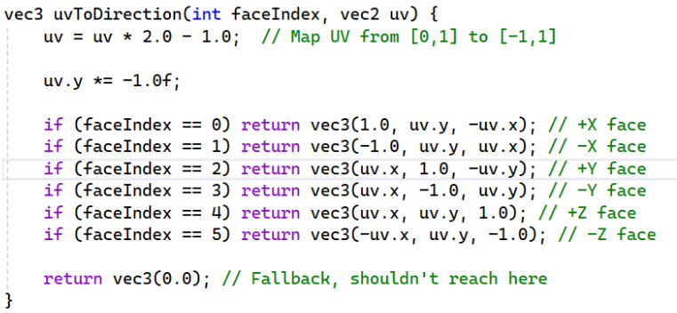

# Enunt

În cadrul acestei teme va trebui să realizați o simulare a unui lac de la munte, în care se varsă o cascadă. Simularea se va face pe timp de noapte, în scenă fiind prezente surse de lumină dinamice. Un video demonstrativ ce înfățișează o posibilă implementare îl puteți viziona în filmulețul de mai jos:

https://youtu.be/rRdWlciy6eU

## Teren
Se va genera procedural un mesh pentru teren. Inițial se va porni de la un grid de rezoluție m x n, iar apoi se vor face următoarele operații de displacement pe vertecșii acestuia:

Definirea suprafețelor concave și convexe ale terenului: Terenul va defini o suprafață convexă pentru zona în care se va afla lacul și una concavă unde vor fi munții. Displacement-ul aferent acestor parabole va fi calculat în funcție de distanța dintre vertecși și centrul mesh-ului astfel:

h = d^2 / 2 * hmax, daca d < 1
h = (1 - (2-d)^2 / 2) * hmax, altfel

unde hmax este înălțimea dorită pentru suprafață, iar d este o valoare calculată în felul următor:

d = distance(v, c) / r

unde v este poziția vertexului curent în planul XZ, c este centrul mesh-ului în planul XZ, iar r este raza gropii.

Denivelări ale suprafeței pentru a da impresia de munți: Pentru asta se poate folosi noise: [The Book of Shaders Noise](https://thebookofshaders.com/11/).

Curbură ce definește zona prin care se va vărsa cascada: Se va folosi o curbă Bezier pe baza căreia se va denivela o parte a terenului. Pentru fiecare pereche (xv, zv) de coordonate ale vertecșilor terenului în planul XZ și fiecare pereche (xc, zc) de coordonate ale curbei Bezier în planul XZ se va calcula parametrul t al curbei Bezier pentru care distanța dintre (xv, zv) și curba proiectată este minimă.

Pentru a găsi cel mai apropiat punct pe o curbă Bezier în 2D, cea mai ușoară soluție este să iterăm cu pași mici pe curbă, evaluând curba în câte două poziții care formează un segment, iar apoi să calculăm matematic cel mai apropiat punct pe fiecare segment.

De asemenea, pe lângă parametrul t, ne interesează și distanța d_bezier dintre vertexul nostru proiectat pe XZ și punctul găsit anterior.

Parametrul t este apoi folosit pentru a evalua curba propriu-zisă (nu cea proiectată pe OZ) și a găsi cel mai apropiat punct de pe curbă. O să numim acest punct b_closest.

Pentru a realiza curbura în teren putem interpola între înălțimea sa inițială și înălțimea celui mai apropiat punct pe curba în 3D (y_b_closest) astfel:

d = distance(v, c) / r

unde r_cascada este raza cascadei noastre.

Folosind formula descrisă mai sus vom avea o curbură, dar aceasta nu va avea o formă naturală. Putem îmbunătăți forma acesteia folosind funcția sinus:

h' = lerp(yb_closest, h, 1 - sin(pi/2 - clamp(d_bezier/r_cascada, 0, 1) * pi/2))

După toate aceste operații, forma terenului este gata, dar mai trebuie calculate normalele pentru a se putea implementa iluminare. După ce avem mesh-ul, putem calcula cu ușurință normalele prin calcularea vectorilor de direcție dintre vertecși adiacenți pe axele X și Z, iar apoi realizarea produsului vectorial dintre acești vectori și normalizarea rezultatului.

Pentru extremitățile mesh-ului este posibil să nu avem vecini ai vertecșilor în fiecare direcție. În cazul în care vertecșii nu au vecini pe anumite direcții, se vor folosi doar vecinii pe care îi au pentru a calcula vectorii de direcție.

## Lumini

În aplicație vor exista mai multe lumini sferice de culori diferite care se vor mișca în scenă. Animațiile acestora nu trebuie să fie complexe, puteți folosi transformări simple precum rotații și translații.

Pentru a începe implementarea puteți folosi laboratorul despre deferred rendering ca punct de plecare.

## Cerul

În implementarea temei trebuie să sintetizați atât cerul cât și pereții exteriori ai mediului înconjurător. Veți folosi un cubemap sugestiv pentru a realiza această sarcină. Varianta folosită în temă este disponibilă este disponibila [aici](cubemap_night/).

## Lacul și Reflexiile

Pentru a reprezenta lacul vom folosi un model de plan. Acesta poate fi încărcat fie din modelele puse la dispoziție de framework, fie generat procedural (ca mesh, sau din geometry shader, etc).

După cum știm, în realitate mediul înconjurător se reflectă pe suprafața apei. Acest efect trebuie implementat și în cadrul temei. O reflexie corectă a mediului înconjurător pe suprafața apei presupune surprinderea tuturor elementelor care se regăsesc deasupra apei (cerul, munții, etc.) și reflectarea acestora pe suprafața sa.

Ne putem raporta la modalitatea în care am implementat reflexia mediului în cadrul laboratorului despre reflexii.

Maparea mediului se realizată din centrul scenei, pe direcțiile prezentate în diagramă.

Dacă dorim să se păstreze și iluminarea în reflexia calculată, atunci va trebui modificat modul de randare a mediului în cubemap. Pentru a face asta, este nevoie de deferred rendering la nivel de cube map, cu shader speciale pentru asta (shader care sa scrie informațiile despre scenă și shader pentru light accumulation).

Procesul este similar cel folosit în laboratoarele despre reflexie și deferred rendering, cu excepția câtorva observații:

Trebuie implementată abilitatea de a defini frame buffere care conțin mai multe texturi de tip cube map. Această funcționalitate se implementează similar cu adăugarea mai multor texturi normale unui frame buffer.
Texturile din cadrul acestor frame buffere trebuie să aibă transparență și să permită lucrul cu valori de tip float în cadrul acestora. Așadar, formatul intern recomandat pentru aceste texturi este GL_RGBA32F, iar formatul lor GL_RGBA.
Pentru fiecare shader care randează obiectele în scenă normal, trebuie să avem și un shader corespunzător care randeaza obiectele în textura de tip cubemap (procesul poate fi automatizat, dar depășește scopul acestei teme).
La pasul de light accumulation pentru a face sampling al texturilor nu mai putem folosi coordonate de textură normale, ci trebuie să specificăm vectori de direcție. Puteți folosi această funcție care calculează vectorii de direcție aferenți coordonatelor de textură ale unei fețe:

faceIndex poate avea valoarea gl_Layer, iar uv poate avea valoarea coordonatelor de textură folosite în laboratorul despre maparea mediului.
Dacă apar probleme la pasul de light accumulation, puteți dezactiva complet GL_DEPTH_TEST

După cum se observă, reflexia nu este una perfectă, ci doar o aproximare. Această variantă de implementare este cea propusă pentru că se leagă de laboratoarele anterioare. Totuși puteți folosi și o metodă alternativă pentru redarea reflexiilor, metodă care oferă rezultate realiste.

Metoda realistă este următoarea: Se folosește un frame buffer pentru a randa scena folosind o cameră care este dedesubtul apei, simetrică față de camera jucătorului. De asemenea, pentru a nu apărea artefacte vizuale, trebuie sa nu se mai randeze fragmentele obiectelor de sub suprafața apei (folosind gl_CullDistance). Imaginea rezultată de această cameră este flipped pe verticală, iar apoi mapata pe suprafața apei folosind coordonatele NDC ale pixelilor de pe ecran.

## Cascada
În cadrul acestei cerințe se va implementa un sistem de particule pentru simularea unei cascade. Particulele vor urma o traiectorie definită de curba Bezier descrisă anterior, iar pentru a genera un efect natural, fiecare particulă va avea un offset aleatoriu față de această curbă. Particulele se vor deplasa pe curba Bezier cu un increment al parametrului t. Valorile pentru acest increment, precum și pentru valoarea de noise sunt la latitudinea voastră (alegeți valori astfel încât să obțineți un efect realist).

Comparativ cu implementarea din cadrul laboratorului de particule, particulele cascadei nu vor avea transparență aplicată prin blending; în schimb, pentru a evita incompatibilități cu tipul de randare deferred, se vor elimina (discard) pixelii transparenți din texturile folosite.

De asemenea, sistemul de particule pentru cascadă trebuie să aibă activat testul de adâncime.

Pentru a nu complica aplicația, particulele NU trebuie să se reflecte pe suprafața apei (decât dacă doriți să implementați această funcționalitate).